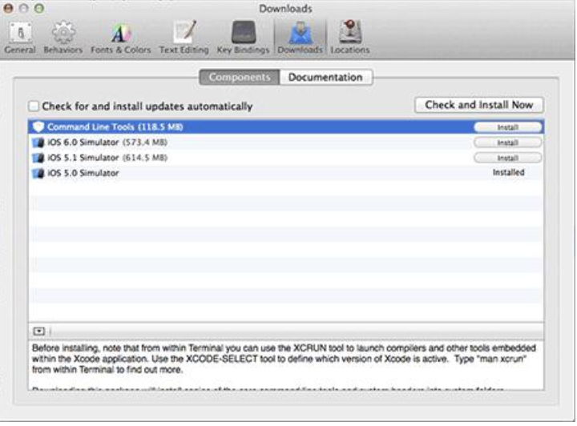
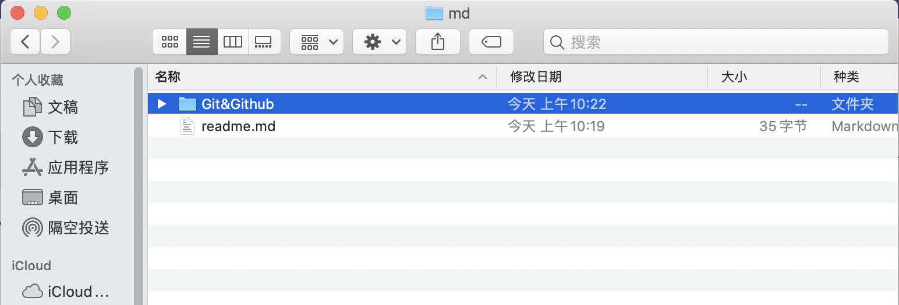
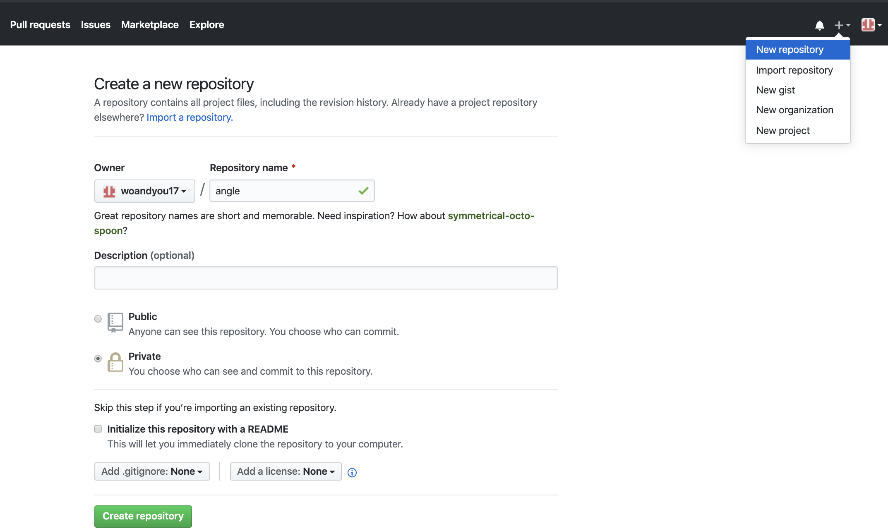

# Git&Github

## 概要

- Git 是一个免费的开源分布式版本控制系统，用于敏捷高效地处理从小型到大型项目的所有内容。
- GitHub是一个远程仓库
- 本地创建了一个Git仓库后，在GitHub同时创建一个Git仓库，并且让这两个仓库进行远程同步，这样，GitHub上的仓库既可以作为备份，又可以让其他人通过该仓库来协作，实现一举多得。
- Git[常用命令集合](https://www.runoob.com/manual/github-git-cheat-sheet.pdf)
- 非常非常详细的教程[廖雪峰的官方网站](https://www.liaoxuefeng.com/wiki/896043488029600)及[RUNOOB菜鸟教程](https://www.runoob.com/git/git-tutorial.html)


## 集中式vs分布式


## 安装

#### Mac OS X上安装

- 两种方法：

  - 一是安装homebrew，然后通过homebrew安装Git，具体方法请参考homebrew的文档：http://brew.sh/

  - 第二种方法更简单，也是推荐的方法，就是直接从AppStore安装Xcode，Xcode集成了Git，不过默认没有安装，你需要运行Xcode，选择菜单“Xcode”->“Preferences”，在弹出窗口中找到“Downloads”，选择“Command Line Tools”，点“Install”就可以完成安装了。

    

#### Windows上安装

- 从Git官网直接[下载](https://git-scm.com/downloads)，然后按默认选项安装即可。
- 安装完成后，在开始菜单里找到“Git”->“Git Bash”，跳出一个类似命令行窗口的东西，就说明Git安装成功。

​                                                            

- 安装完成后，还需要最后一步设置，在命令行输入：

  ```
  $ git config --global user.name "Your Name"
  $ git config --global user.email "email@example.com"
  ```

  注意`git config`命令的`--global`参数，用了这个参数，表示你这台机器上所有的Git仓库都会使用这个配置


## CONFIGURE TOOLING

- Configure user information for all local repositories


## 创建新仓库

- **定义：**

  版本库又名仓库，英文名**repository**，可以简单理解成是一个目录，这个目录里面的所有文件都可以被Git管理起来，每个文件的修改、删除，Git都能跟踪，以便任何时刻都可以追踪历史，或者在将来某个时刻进行“还原”。

- **创建步骤：**

  - 第一步：选择一个合适的地方，创建一个空目录：

    ```
    $ cd /Users/yunruixin/Documents/git/md
    $ mkdir git
    $ pwd
    /Users/yunruixin/Documents/git/md
    ```

    `pwd`命令用于显示当前目录。在我的Mac上，这个仓库位于`/Users/yunruixin/Documents/git/md

  - 第二步：通过`git init`命令把这个目录变成Git可以管理的仓库：

    ```
    $ git init
    Initialized empty Git repository in /Users/yunruixin/Documents/git/md/.git/
    ```

    - 如此Git就把仓库建好了，而且提示是一个空的仓库，当前目录下多了一个`.git`的目录，这个目录是Git来跟踪管理版本库的。*注意：**切勿随意手动修改**这个目录里面的文件，否则可能会破坏Git仓库。*

    - 如果没有看到`.git`目录，那是因为这个目录默认是隐藏的，用`ls -ah`命令就可以看见。

      ```
      .	..	.git
      ```
    
  - PS:如果你使用Windows系统，为了避免遇到各种莫名其妙的问题，请确保目录名（包括父目录）**不要包含中文**。


## 添加/修改文件到版本库

- **准备测试文件**

  - 编写一个`readme.md`文件，内容如下：

    ```
    keep it simple, stupid
    ```

    

- **添加步骤**

  - 第一步，用命令`git add` 告诉Git，把文件添加到版本库：

    ```
    $ git add readme.md
    ```

    - 执行上面的命令，没有任何显示即为提交成功
    - `git add .`表示把当前目录下的所有文件都加到版本库；`git add *.[文件类型]`表示把同一类型的文件加到版本库，如`git add *.xml`表示把当前目录下所有的xml文件加到版本库

  - 第二步，用命令`git commit`告诉Git，把文件提交到版本库：

    ```
    $ git commit -m "new"
    [master (root-commit) 001c082] new
     1 file changed, 2 insertions(+)
     create mode 100644 readme.md
    ```

    - `-m`(message)后面输入的是本次提交的说明，可以输入修改的内容，以便我们从历史记录里找到修改记录。`git commit`命令执行成功后会提示，`1 file changed`：1个文件被改动（我们新添加的readme.md文件）；`2 insertions`：插入了两行内容（readme.md有两行内容）
  - 通过`git commit -a` 命令可以一次提交所有尚未提交到master的内容，命令后面跟 -m “message”
    
  - Git添加文件需要`add`，`commit`两步，因为`commit`可以一次提交多个文件，所以可以多次`add`不同的文件，比如：
    
    ```
      $ git add file1.txt
      $ git add file2.txt file3.txt
      $ git commit -m "add 3 files."
    ```

- **修改步骤**

  - 修改测试文件readme.md文件如下：

    ```
    KISS
    keep it simple, stupid
    ```

  - 修改和添加是一样操作步骤，对相同的文件再次添加`git add`即是覆盖之前的文件。提交命令如下：

    ```
    $ git add readme.md
    shins-MacBook-Pro:md yunruixin$ git commit -m "add kiss"
    [master fd33152] add kiss
     1 file changed, 3 insertions(+), 1 deletion(-)
     
    ```

- **注意事项：**

  - 所有的版本控制系统只能跟踪文本文件的改动，比如TXT文件，网页，所有的程序代码等，Git也不例外。版本控制系统可以告诉你每次的改动，比如在第5行加了一个单词“Linux”，在第8行删了一个单词“Windows”。而图片、视频这些二进制文件，虽然也能由版本控制系统管理，但没法跟踪文件的变化，只能把二进制文件每次改动串起来，也就是只知道图片从100KB改成了120KB，但到底改了啥，版本控制系统不知道，也没法知道。Microsoft的Word格式是二进制格式，因此，版本控制系统是没法跟踪Word文件的改动的，如果要真正使用版本控制系统，就要以纯文本方式编写文件。因为文本是有编码的，比如中文有常用的GBK编码，日文有Shift_JIS编码，我们建议使用标准的UTF-8编码，所有语言使用同一种编码，既没有冲突，又被所有平台所支持。

  - PS: 千万不要使用Windows自带的**记事本**编辑任何文本文件。原因是Microsoft开发记事本的团队使用了一个非常弱智的行为来保存UTF-8编码的文件，他们自作聪明地在每个文件开头添加了0xefbbbf（十六进制）的字符，你会遇到很多不可思议的问题，比如，网页第一行可能会显示一个“?”，明明正确的程序一编译就报语法错误等等，都是由记事本的弱智行为带来的。建议你下载[Notepad++](http://notepad-plus-plus.org/)代替记事本，不但功能强大，而且免费！记得把Notepad++的默认编码设置为UTF-8 without BOM即可：

    


##     工作区和暂存区

####   本地仓库的构成

- 第一个是你的 `工作目录`，即工作区（Working Directory），它持有实际文件。比如我的`md`文件夹就是一个工作区：

  

- 第二个是版本库（Repository)：工作区有一个隐藏目录`.git`，这个不算工作区，而是Git的版本库。版本库里存了很多东西，最重要的是以下两部分：

  - 一个是暂存区`（Index）`，它像个缓存区域，临时保存你的改动。

  - 另一个是Git为我们自动创建的第一个且唯一一个分支`master`(承载最后一次提交的结果)，以及指向`master`的一个指针叫`HEAD`。

#### 工作流程

- 第一步通过`git add`把文件从工作区添加到版本库的暂存区；
- 第二步通过`git commit`提交更改，实际上就是把暂存区的所有内容提交到当前分支master。


- **举例说明：**

  - 先对`readme.md`做个修改

    ```
    KISS
    keep it simple, stupid
    HW
    hello world！
    ```

  - 在工作区新增一个`LICENSE`文本文件（内容随意）

  - 用`git status`查看一下状态：

    ```
    $ git status
    On branch master
    Changes not staged for commit:
      (use "git add <file>..." to update what will be committed)
      (use "git restore <file>..." to discard changes in working directory)
    	modified:   readme.md
    
    Untracked files:
      (use "git add <file>..." to include in what will be committed)
    	.DS_Store
    	Git&Github/
    	LICENSE.md
    
    no changes added to commit (use "git add" and/or "git commit -a")
    ```

    - Git非常清楚地告诉我们，`readme.md`被修改了，而`LICENSE`还从来没有被添加过，所以它的状态是`Untracked`。

  - 现在，使用两次命令`git add`，把`readme.md`和`LICENSE`都添加后，用`git status`再查看一下：

    ```
    $ git status
    On branch master
    Changes to be committed:
      (use "git reset HEAD <file>..." to unstage)
    
    	new file:   LICENSE
    	modified:   readme.md
    ```

    - 每次修改，如果不用`git add`到暂存区，那就不会加入到`commit`中

  - 现在，暂存区的状态就变成这样:

    

    - 所以，`git add`命令实际上就是把要提交的所有修改放到暂存区（Index），然后，执行`git commit`就可以一次性把暂存区的所有修改提交到分支。

      ```
      $ git commit -m "add HW to readme and new LICENSE"
      [master c144d3e] add HW to readme and new LICENSE file
       2 files changed, 5 insertions(+)
       create mode 100644 LICENSE.md
      ```

  - 现在，暂存区的状态就变成这样:


- 

  - 一旦提交后，如果你又没有对工作区做任何修改，那么工作区就是“干净”的：

    ```
    $ git status
    On branch master
    nothing to commit, working tree clean
    ```

- **查看工作区与暂存区的版本区别**

  `git diff HEAD -- readme.md命令可以查看工作区和版本库里面最新版本的区别：

  ```
  $ git diff HEAD -- readme.md
  diff --git a/readme.md b/readme.md
  index f1e2693..e3d58f3 100644
  --- a/readme.md
  +++ b/readme.md
  @@ -6,3 +6,7 @@ keep it simple, stupid
   
   hello world！
   
  +#### WAY
  +Woandyou17
  ```


## 版本回退

- **查看历史版本记录**

  - 用`git log`命令查看：
  
    ```
    $ git log
    commit fd3315299517970fc5b48ad02a5bfc43b1067f17 (HEAD -> master)
    Author: woandyou17 <ruixin@aegleanalytica.io>
    Date:   Fri Mar 27 09:47:15 2020 +0800
    
        add kiss
    
    commit 001c08264b2441c60331a386fb07ac3e855bc489
    Author: woandyou17 <ruixin@aegleanalytica.io>
    Date:   Fri Mar 27 00:04:16 2020 +0800
    
        new
    ```
  
    - `git log`命令显示**从最近到最远**的提交日志
  
- **版本回退**

  - 首先，Git必须知道当前版本是哪个版本，在Git中，用`HEAD`表示当前版本，也就是最新的提交`fd33152...`（注意每个人的提交ID都是不一样的），上一个版本就是`HEAD^`，上上一个版本就是`HEAD^^`，当然往上100个版本写100个`^`比较容易数不过来，所以写成`HEAD~100`。

    回退到上一个版本，执行命令如下：

    ```
    $ git reset --hard HEAD^
    HEAD is now at 001c082 new
    ```

  - 回退到具体某一个版本时，可以输入几位版本号

    ```
    $ git reset --hard fd3315
    HEAD is now at fd33152 add kiss
    ```

  - 看看readme.md的内容，用`cat`命令:

    ```
    $ cat readme.md
    #### KISS
    keep it simple, stupid
    ```

- **重返未来**

  - 用`git reflog`命令查看历史命令记录

    ```
    $ git reflog
    fd33152 (HEAD -> master) HEAD@{0}: reset: moving to fd3315
    68de3c1 HEAD@{1}: commit: add kiss
    fd33152 (HEAD -> master) HEAD@{2}: reset: moving to fd3315
    001c082 HEAD@{3}: reset: moving to HEAD^
    fd33152 (HEAD -> master) HEAD@{4}: reset: moving to fd3315
    001c082 HEAD@{5}: reset: moving to HEAD^
    fd33152 (HEAD -> master) HEAD@{6}: commit: add kiss
    001c082 HEAD@{7}: commit (initial): new
    ```


## 撤销修改

- **两种情况**

  - 一种是`readme.md`自修改后还没有被放到暂存区，现在，撤销修改就回到和版本库一模一样的状态；

  - 一种是`readme.md`已经添加到暂存区后，又作了修改，现在，撤销修改就回到添加到暂存区后的状态。

    总之，就是让这个文件回到最近一次`git commit`或`git add`时的状态。


## 删除文件

- **删除文件**

  - 第一步，从工作区目录将文件删除，或者用`rm`命令删除

    ```
    $ rm test.md
    ```

  - 如此Git知道你删除了文件，因此工作区和版本库就不一致了，`git status`命令会立刻告诉你哪些文件被删除了

    ```
    $ git status
    On branch master
    Changes not staged for commit:
      (use "git add/rm <file>..." to update what will be committed)
      (use "git checkout -- <file>..." to discard changes in working directory)
    
    	deleted:    test.txt
    
    no changes added to commit (use "git add" and/or "git commit -a")
    ```

  - 从版本库中删除该文件，用命令`git rm`删掉，并且`git commit`

    ```
    $ git rm test.txt
    rm 'test.txt'
    
    $ git commit -m "remove test.txt"
    [master d46f35e] remove test.txt
     1 file changed, 1 deletion(-)
     delete mode 100644 test.txt
    ```

  - 文件就从版本库中被删除了

- **恢复误删文件**

  - 把误删的文件恢复到最新版本，因为版本库里还有，所以可以很轻松地把误删的文件恢复到最新版本：

    ```
    $ git checkout -- test.txt
    ```

    `git checkout`其实是用版本库里的版本替换工作区的版本，无论工作区是修改还是删除，都可以“一键还原”。


##  远程仓库

#### 创建新仓库

- 登录[Github](https://github.com/)，点击New或在右上角找到“New repository”按钮，创建一个新的仓库



- 在Repository name填入`angel`，其他保持默认设置，点击“Create repository”按钮，就成功地创建了一个新的Git仓库：

  

- 目前，在GitHub上的这个`angel`仓库还是空的，GitHub告诉我们，可以从这个仓库克隆出新的仓库，也可以把一个已有的本地仓库与之关联，然后，把本地仓库的内容推送到GitHub仓库。

- 接下来，我们将本地仓库关联到远程仓库，

  ```
  git remote add origin git@github.com:woandyou17/angel.git
  ```

  - 执行命令后提示：

    ```
    @github.com:woandyou17/angel.git
    usage: git remote add [<options>] <name> <url>
    
        -f, --fetch           fetch the remote branches
        --tags                import all tags and associated objects when fetching
                              or do not fetch any tag at all (--no-tags)
        -t, --track <branch>  branch(es) to track
        -m, --master <branch>
                              master branch
        --mirror[=(push|fetch)]
                              set up remote as a mirror to push to or fetch from
    
    ```

- 关联后，远程库的名字就是`origin`，这是Git默认的叫法，也可以改成别的，但是`origin`这个名字一看就知道是远程库。

- 下一步，就可以把本地库的所有内容推送到远程库上，用`git push`命令，实际上是把当前分支`master`推送到远程库，

  ```
  $ git push -u origin master
  Enumerating objects: 16, done.
  Counting objects: 100% (16/16), done.
  Delta compression using up to 4 threads
  Compressing objects: 100% (8/8), done.
  Writing objects: 100% (16/16), 1.30 KiB | 667.00 KiB/s, done.
  Total 16 (delta 0), reused 0 (delta 0)
  To https://github.com/woandyou17/angel.git
   * [new branch]      master -> master
  Branch 'master' set up to track remote branch 'master' from 'origin'.
  ```

  - 由于远程库是空的，我们第一次推送`master`分支时，加上了`-u`参数，Git不但会把本地的`master`分支内容推送的远程新的`master`分支，还会把本地的`master`分支和远程的`master`分支关联起来，在以后的推送或者拉取时就可以简化命令。

- 从现在起，只要本地作了提交，就可以通过命令：

  ```
  $ git push origin master
  ```


检出仓库

- 执行如下命令以创建一个本地仓库的克隆版本：

  `git clone /path/to/repository`

- 如果是远端服务器上的仓库，你的命令会是这个样子：

  `git clone username@host:/path/to/repository`


